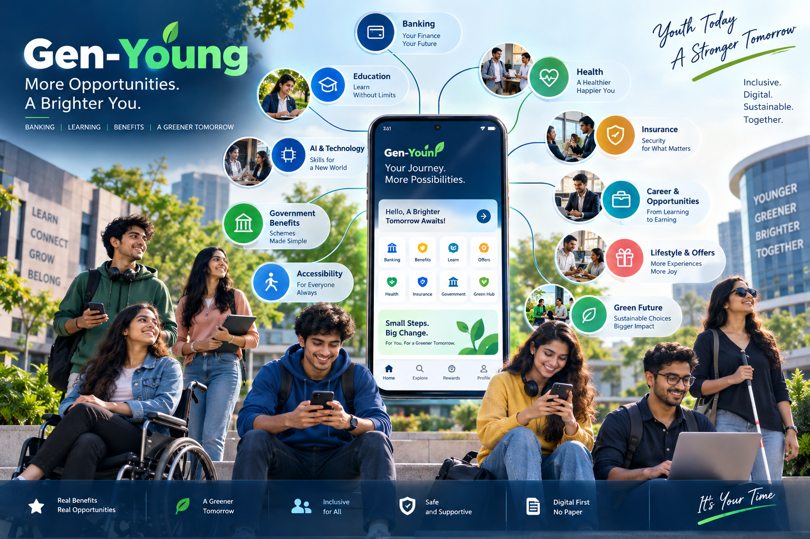
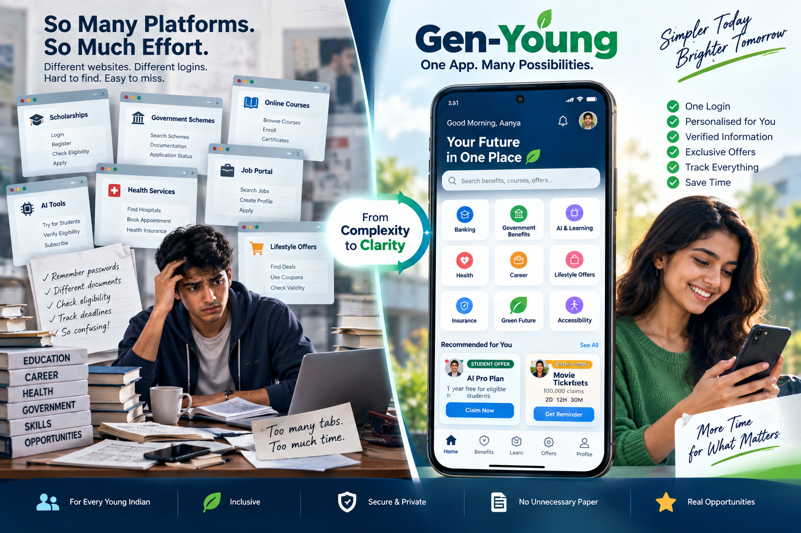
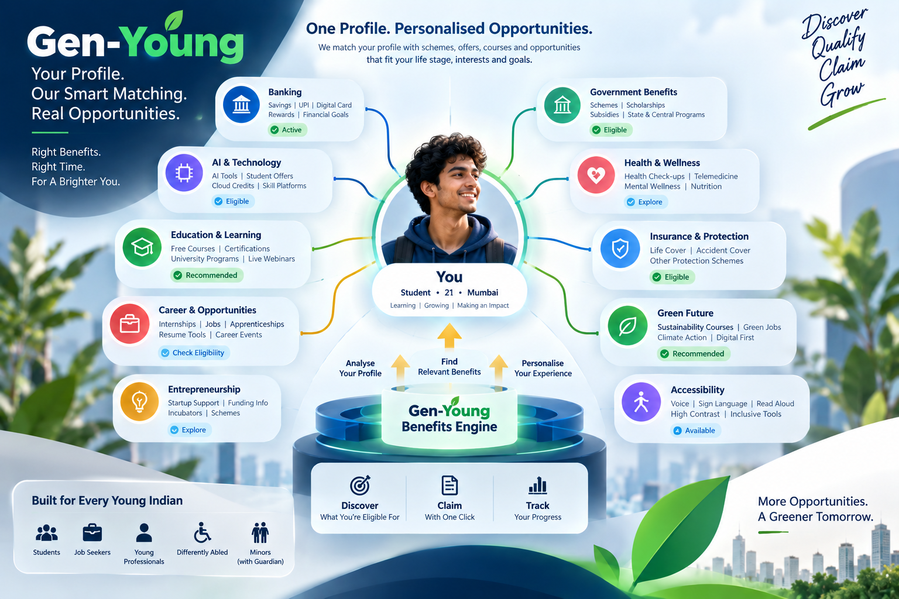
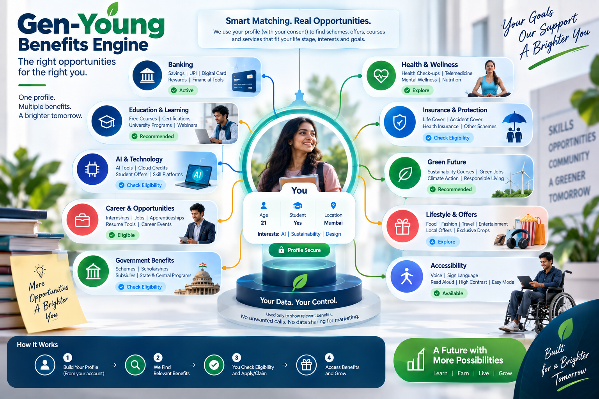
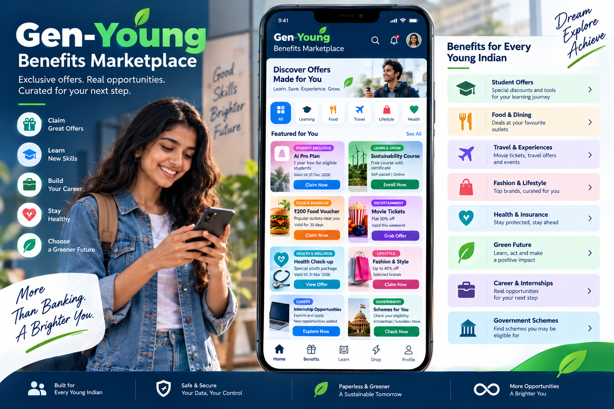
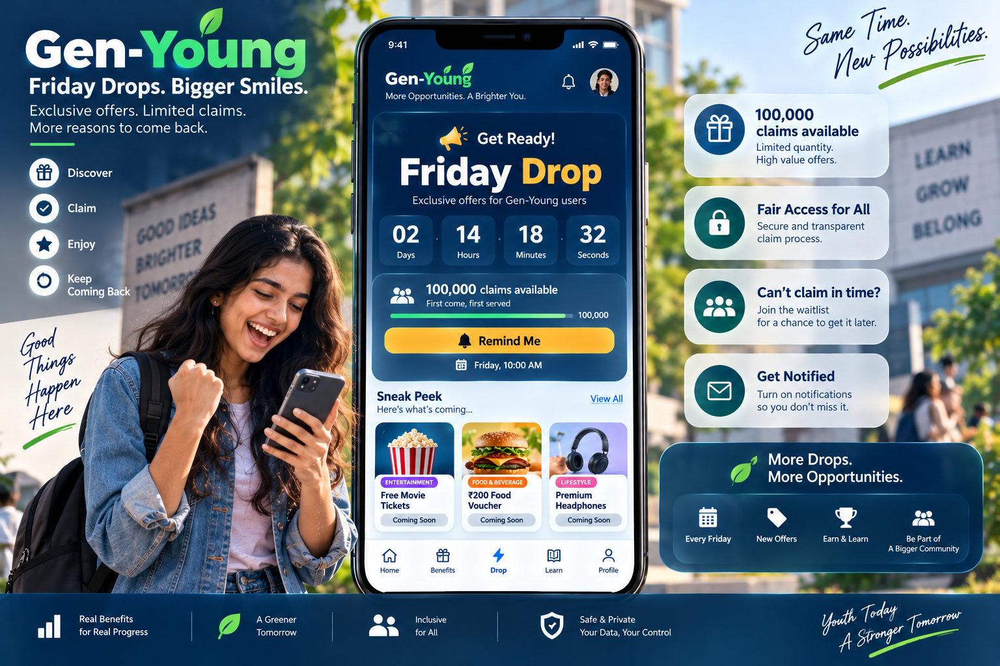
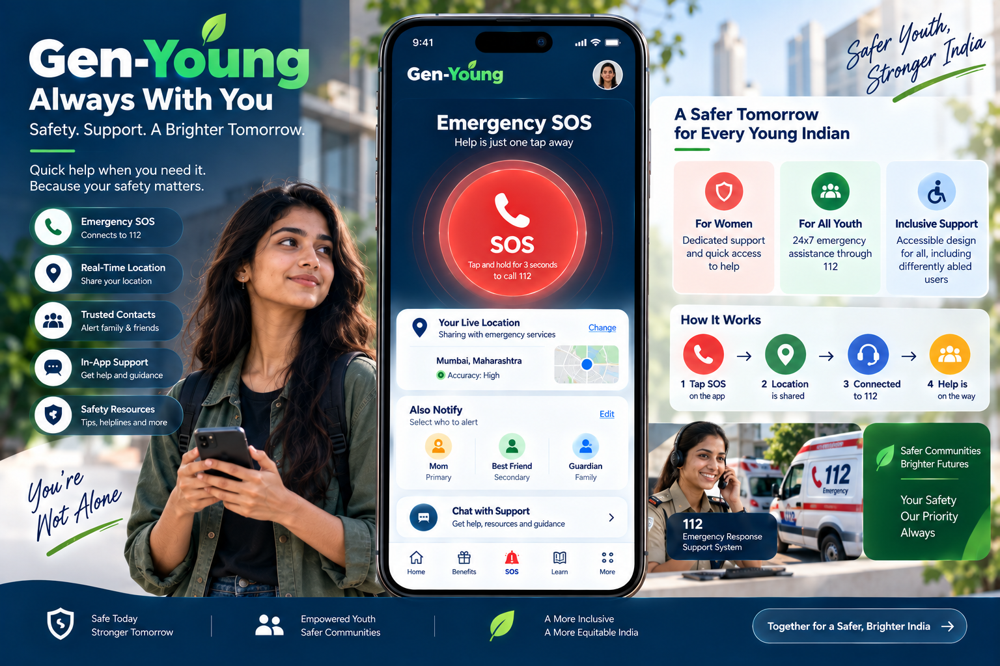
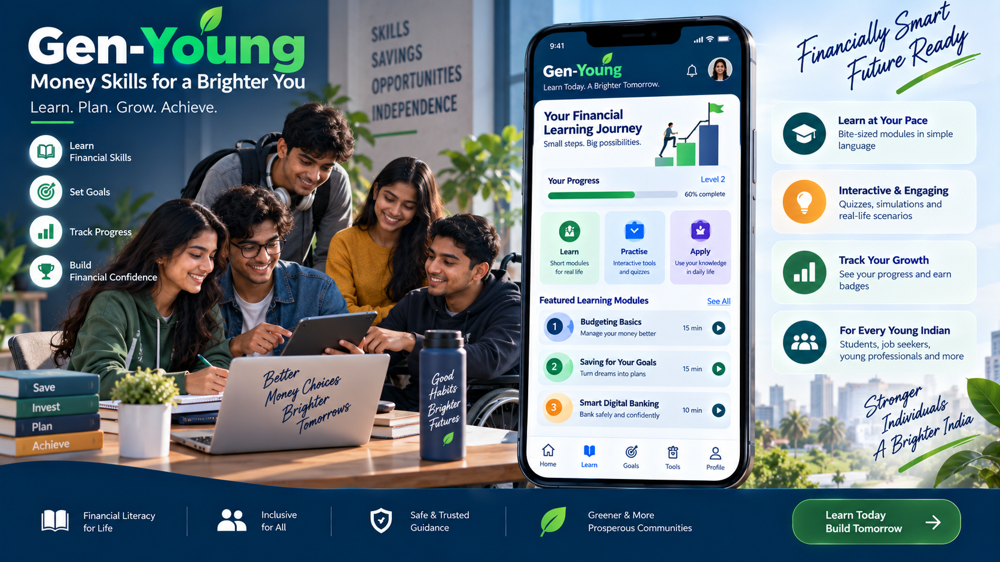

# GEN-YOUNG
> **The Digital, Inclusive Youth Banking & Benefits Platform**  
> *A product concept for a digital-first bank account built around benefits, access, opportunity, and trust.*

---

## 🌟 Executive Summary

**Gen-Young** is not another conventional student account with random coupons. It is a **trusted access layer** between young Indian citizens (ages 15–25) and the benefits, government entitlements, educational pathways, career opportunities, and protection tools already available around them.

Instead of navigating dozen fragmented government and commercial websites, young citizens have one personalized, transparent, accessible-by-design digital banking gateway:

> **\"Your Money. Your Benefits. Your Future.\"**

---

## 📸 Visual Showcase & Architecture Walkthrough

### 1. Vision & The Gen-Young Proposition

*Connecting Banking, Education, AI & Technology, Government Schemes, Accessibility, Health, Insurance, Careers, Lifestyle, and Green Future.*

---

### 2. From Complexity to Clarity — The Core Experience

*A mobile-first dashboard that separates core banking functions (zero-balance savings, virtual RuPay card, UPI, savings goals) from curated, sponsored, and government benefits.*

---

### 3. Smart Matching & The Benefits Engine

*Attribute-based matching (age, student status, city, interests) without data leakage. DPDP Act compliance ensures no cold calls and no third-party data broker sharing.*

---

### 4. The Benefits Marketplace & 4-State Wallet

*Explore opportunities across Government Schemes (myScheme, scholarships), AI Tools (Google AI Plus student year, IndiaAI compute), SWAYAM/NPTEL courses, and student perks with a dedicated 4-State Benefits Wallet (Available, Claimed, Active, Expiring Soon).*

---

### 5. The Friday Drop Economy

*Timed, limited-inventory releases (e.g. 100,000 cinema tickets or meal vouchers every Friday at 10:00 AM). Features real-time countdowns, instant capacity decrements, and transparent waitlists.*

---

### 6. Emergency SOS & Women's Safety Hub

*A high-stress accessible emergency system featuring a 3-second press-and-hold trigger, 10-second cancel window, direct simulated 112 ERSS integration, trusted contact alerts, live GPS tracking, and real-time hazard warnings.*

---

### 7. Financial Learning & Skill Paths

*Bite-sized financial literacy modules, interactive 5-minute quizzes, daily streaks, level progression (Novice to Master), and actionable 3-step quests unlocking non-cash perks.*

---

## 🏛️ The 7 Core Pillars

| # | Pillar | Description & Key Features |
|---|---|---|
| **R1** | **Banking Foundation** | Zero-balance youth savings account, virtual RuPay debit card with 3D flip, card freeze controls, simulated UPI payments, and target-based savings pots with confetti milestones. |
| **R2** | **Benefits Engine** | Personalized matching for ages 15–25, 5-question benefit cards (What, Why, Who, Cost, Next Action), \"Why am I seeing this?\" DPDP attribution, and 4-state Benefits Wallet. |
| **R3** | **Friday Drop Engine** | Flagship weekly drops, live millisecond-accurate countdown, live inventory bar, instant claim decrements, double-claim prevention, and fair-access waitlists. |
| **R4** | **Emergency SOS Hub** | 3-second hold trigger with SVG progress animation and Web Audio beeps, 10s false-alarm abort, simulated 112 ERSS dispatch, trusted contact alerts, and weather hazard alerts. |
| **R5** | **Financial Literacy & Quests** | Micro-learning modules (Budgeting, Saving, Smart Banking), 5-minute quizzes, daily streaks (🔥 N-Days), level progression (XP), and multi-step action quests. |
| **R6** | **Green Gen-Young** | Green Future Hub connecting users to UN SDG Academy and UN CC:e-Learn courses, Green Passport tracking verified eco-actions, paperless metrics, and verifiable badges. |
| **R7** | **Universal Accessibility** | Web Speech API Read-Aloud (TTS) with play/pause/speed controls, WCAG AAA high-contrast theme, dynamic text scaling, Indian Sign Language (ISL) visual guides, and DPDP privacy controls. |

---

## 💻 Tech Stack & Architecture

- **Frontend Core**: React 18 + TypeScript + Vite
- **Styling**: Tailwind CSS (with full High-Contrast mode and dark accessibility palettes)
- **Icons**: Lucide React
- **Audio & Speech**:
  - Native **Web Audio API** (AudioContext oscillators for procedural countdown beeps, SOS sirens, and UPI payment chimes — 0 external audio dependencies)
  - Native **Web Speech API** (window.speechSynthesis for universal accessibility read-aloud)
- **State Management**: Context Providers (PersonaContext, BankingContext, BenefitsContext, AccessibilityContext, ToastContext) with localStorage persistence.
- **Specification Source**: [GEN-YOUNG 50-Page Concept Paper](GEN-YOUNG_50_Page_Concept_Paper.pdf)

---

## 🚀 Getting Started

### Prerequisites
- Node.js (v18 or higher)
- npm or yarn

### Installation & Run
`ash
# Navigate to the app directory
cd gen_young_app

# Install dependencies
npm install

# Start the local development server
npm run dev

# Build for production
npm run build
`

---

## 🗺️ Implementation Roadmap

- [x] **Phase 0**: Architectural Survey & Formal Specification Mining (50 chapters, R1–R7, 40 features)
- [ ] **Milestone 1**: Core Scaffolding, App Shell, Persona Context, and Banking Foundation
- [ ] **Milestone 2**: Benefits Engine, Categorized Marketplace, 5-Question Cards, and 4-State Wallet
- [ ] **Milestone 3**: Friday Drop Engagement Engine & Emergency SOS 112 Hub
- [ ] **Milestone 4**: Financial Learning Quests, Green Passport, Accessibility (TTS/ISL), and DPDP Privacy Center
- [ ] **Milestone 5**: Full Integration Verification & End-to-End Test Suite Pass

---

## 📜 License & Acknowledgements
Built for the Gen-Young digital youth banking initiative. Detailed specifications adapted from the *GEN-YOUNG Digital Youth Banking & Benefits Platform Concept Paper*.
