<p align="center">
  
</p>

<h1 align="center">GEN-YOUNG</h1>

<p align="center">
  <strong>The Digital, Inclusive Youth Banking &amp; Benefits Platform</strong><br>
  <em>Youth Today. A Stronger Tomorrow.</em>
</p>

<p align="center">
  <em>A concept product for a digital-first bank account built around benefits, access, opportunity, trust — and radical inclusivity. Designed for every young Indian aged 15–25.</em>
</p>

<p align="center">
  
  
  
  
  <br>
  
  
  
  
  <br>
  
  
  
  
</p>

<p align="center">
  <a href="https://37omkar.github.io/GEN-YOUNG/"></a>
  &nbsp;
  <a href="GEN-YOUNG_50_Page_Concept_Paper.pdf"></a>
</p>

<p align="center">
  <a href="#-live-web-page">Live Web Page</a> •
  <a href="#-executive-summary">Overview</a> •
  <a href="#-visual-showcase">Visual Showcase</a> •
  <a href="#-the-lifecycle-model">Lifecycle</a> •
  <a href="#-inclusivity--accessibility-first">Inclusivity</a> •
  <a href="#-the-7-core-pillars">Pillars</a> •
  <a href="#-tech-stack">Tech</a> •
  <a href="#-getting-started">Get Started</a> •
  <a href="#-roadmap">Roadmap</a> •
  <a href="#-trust-privacy--compliance">Trust</a>
</p>

---

## 🌐 Live Web Page

**Read the full concept as a webpage — all 20 design boards, images, and the 50-page paper — in your browser:**

<p align="center">
  <a href="https://37omkar.github.io/GEN-YOUNG/">
    <strong>🌐 https://37omkar.github.io/GEN-YOUNG/</strong>
  </a>
</p>

Auto-deployed from `main` via GitHub Actions on every push. The landing page renders this README with a dark GitHub-flavoured theme, all 20 design boards inline, and a one-click download for the [50-page concept paper](GEN-YOUNG_50_Page_Concept_Paper.pdf).

**Enabling Pages (repo owner one-time setup):** *Settings → Pages → Source → **GitHub Actions***. Deploy status: [](https://github.com/37OMKAR/GEN-YOUNG/actions/workflows/deploy-pages.yml)

### 🧪 Try the interactive app locally

The full click-through demo (SOS 3-sec hold, quizzes with XP, Green Impact points, Benefits claim + voucher, live Drop countdown) runs from source — see [Getting Started](#-getting-started) below. Deploying the interactive app to Pages will be a follow-up commit.

---

## 🌟 Executive Summary

> **Core idea:** Gen-Young is not another account with coupons. It is a **trusted access layer** between a young customer and the benefits, opportunities, and tools already available around them.

Young Indians today juggle a bank app, a scholarship portal, a jobs board, a government scheme site, multiple brand apps, and half a dozen learning platforms — each with its own login, its own eligibility rules, and its own paperwork. **Thousands of eligible scholarships, subsidies, and youth-only offers go unclaimed every year — not because young Indians don't care, but because discovering, verifying and applying is a full-time job.**

Gen-Young collapses that complexity into a single, personalised, transparent, accessible-by-design digital banking gateway. The bank account remains the foundation — a **zero-minimum-balance youth savings account** with a virtual RuPay card and UPI — but the app becomes a practical gateway to everything a young Indian needs in daily life: **government schemes, learning, AI tools, health, insurance, internships, jobs, entrepreneurship, local offers, safety, community, and a greener future**.

<p align="center">
  <strong>"Your Money. Your Benefits. Your Future."</strong>
</p>

### 🎯 What Makes Gen-Young Different

| It's Not | It Is |
|---|---|
| ❌ A student savings account bolted onto random coupons | ✅ A **trusted access layer** to real, verified opportunities |
| ❌ A benefits aggregator that leaks data to advertisers | ✅ **DPDP-compliant** bank-controlled matching — no cold calls, no third-party data sharing |
| ❌ An app built for one "typical" young user | ✅ **Universally accessible** — voice, ISL sign language, high contrast, easy mode |
| ❌ A wallet that ignores your future | ✅ A **skills, safety, community and sustainability** platform with real career impact |
| ❌ Flashy ads and fake countdowns | ✅ **Real scarcity, visible rules, fair access, no fake urgency** |

---

## 📸 Visual Showcase

> An in-depth walkthrough of the Gen-Young product concept across **twenty design boards** — from the vision, through every core module, all the way to the sustainable commercial model. Every image is rendered full-width; every section is grounded in the [50-page concept paper](GEN-YOUNG_50_Page_Concept_Paper.pdf).

---

### 🌍 01 — The Vision: Youth Today. A Stronger Tomorrow.

<p align="center">
  
</p>

Gen-Young is built around **ten interconnected life pillars**: Banking, Education, AI & Technology, Government Benefits, Health, Insurance, Career & Opportunities, Lifestyle & Offers, Accessibility, and a Green Future.

The hero deliberately features students on wheelchairs, users with visual impairment aids, and youth from every walk of life — because *"For Everyone, Always"* isn't a marketing line, it's an architectural constraint on every screen we build. The proposition sits on six product promises:

> **Real Benefits · A Greener Tomorrow · Inclusive for All · Safe and Supportive · Digital First · No Paper**

---

### 🧭 02 — From Complexity to Clarity

<p align="center">
  
</p>

**The problem:** *So many platforms. So much effort. Different websites. Different logins. Hard to find. Easy to miss.* A young Indian today juggles scholarship portals, government scheme sites, health service booking, job boards, AI tool signups, and lifestyle offers — each with its own login, its own eligibility rules, and its own paperwork.

**The Gen-Young answer:** **One App. Many Possibilities.** A single mobile-first home screen with nine clear entry tiles — Banking · Government Benefits · AI & Learning · Health · Career · Lifestyle Offers · Insurance · Green Future · Accessibility — plus a *Recommended for You* strip that surfaces offers you are eligible for **right now**.

**Delivered value:** One Login · Personalised for You · Verified Information · Exclusive Offers · Track Everything · Save Time.

---

### 🧠 03 — The Smart Matching Engine

<p align="center">
  
</p>

**One profile. Personalised opportunities.** The Benefits Engine takes a single, consent-driven profile — age, student status, city, interests, life stage — and matches you across ten opportunity categories: Banking, Government Benefits, AI & Technology, Health & Wellness, Education & Learning, Insurance & Protection, Career & Opportunities, Green Future, Entrepreneurship, and Accessibility.

**Built for every young Indian.** The engine explicitly models — and every E2E test covers — **five distinct user classes**:

> 🎓 **Students** · 💼 **Job Seekers** · 👨‍💼 **Young Professionals** · ♿ **Differently-Abled Users** · 👨‍👩‍👧 **Minors (with Guardian consent)**

**The four-step flow:** **Analyse Your Profile → Find Relevant Benefits → Personalise Your Experience → Discover · Claim · Track.**

---

### 🔒 04 — Benefits Engine & Privacy-First Data Control

<p align="center">
  
</p>

**Your Data. Your Control.** Every benefit surfaced comes with a **"Why am I seeing this?"** attribution card that shows exactly which profile attributes contributed to the match — and one-tap control to opt out of any signal.

**Bank-controlled matching, not data-broker sharing.** The brand provides campaign rules (age band, location, product interest). The bank's internal system identifies eligible customers under the approved consent model. **The brand receives only the information it actually needs to fulfil the campaign** — never your phone number or contact details unless you have explicitly claimed the offer.

**How it works — a transparent 4-step flow:**

1. **Build Your Profile** — from your account, one time, consent-driven
2. **We Find Relevant Benefits** — matched via your profile, not your browsing history
3. **You Check Eligibility & Apply/Claim** — on your terms, at your pace
4. **Access Benefits & Grow** — learn · earn · live · grow

---

### 🛍️ 05 — The Benefits Marketplace

<p align="center">
  
</p>

**Exclusive offers. Real opportunities. Curated for your next step.** The marketplace organises the entire universe of youth-relevant offers into eight clear categories:

| Category | What's Inside |
|---|---|
| 🎓 **Student Offers** | Special discounts and tools for your learning journey |
| 🍽️ **Food & Dining** | Deals at your favourite outlets |
| ✈️ **Travel & Experiences** | Movie tickets, travel offers, events |
| 🛍️ **Fashion & Lifestyle** | Top brands curated for you |
| ❤️ **Health & Insurance** | Stay protected, stay ahead |
| 🌱 **Green Future** | Learn, act, make a positive impact |
| 💼 **Career & Internships** | Real opportunities for your next step |
| 🏛️ **Government Schemes** | myScheme discovery for eligible schemes |

**Every benefit card answers 5 questions** *(What is it? Why am I seeing it? Who provides it? What does it cost? What do I do next?)* and carries one of five statuses: **Available · Check Eligibility · Apply · Active · Expiring Soon**.

**Backed by the 4-State Benefits Wallet:** Available → Claimed → Active → Expiring Soon — so you never lose track of an offer you've unlocked.

---

### ⚡ 06 — The Friday Drop Economy

<p align="center">
  
</p>

**Friday Drops. Bigger Smiles.** Every Friday at 10:00 AM, Gen-Young releases a batch of timed, limited-inventory offers — 100,000 movie tickets, ₹200 food vouchers, premium headphones — that create ritual anticipation and give users a reason to return week after week.

**The five Drop types** *(from the concept paper)*:

| Drop Type | Example |
|---|---|
| **Scheduled Drop** | Friday 10:00 AM · 100,000 cinema claims |
| **Learning Drop** | Complete a climate quiz · unlock a partner benefit |
| **Local Drop** | Nearby restaurant offer available for one hour |
| **Event Drop** | Limited seats for a Government or institutional webinar |
| **Milestone Drop** | Complete a 10-day learning streak · receive a partner voucher |

**Design rule:** *Real scarcity, visible rules, fair access, no fake urgency.* Real-time millisecond countdown · live inventory bar · instant server-verified decrements · double-claim prevention · fair-access waitlist for returned inventory · Remind Me and Get Notified · Sneak Peek of upcoming drops.

---

### 🆘 07 — Emergency SOS & Safety Hub

<p align="center">
  
</p>

**Always With You.** Gen-Young's SOS is a purpose-built safety layer for every young Indian — **women, differently-abled users, minors, and every youth in between**.

**The 4-step response chain** *(built on India's 112 ERSS)*:

1. **Tap SOS** — a red 3-second press-and-hold button with SVG progress animation and audible Web Audio beeps (10-second cancel window prevents false alarms)
2. **Location is shared** — high-accuracy live GPS coordinates dispatched to responders and trusted contacts
3. **Connected to 112** — integration with India's **112 Emergency Response Support System** (police / ambulance / fire)
4. **Help is on the way** — up to **five trusted contacts** (Mom · Best Friend · Guardian · …) receive your live location in parallel

**Safety Hub features:** Emergency SOS · Real-Time Location · Trusted Contacts · In-App Support · Safety Resources. Dedicated women's safety support, 24×7 emergency assistance, and inclusive design for differently-abled users under stress (large controls, voice prompts, strong contrast, minimal steps, offline fallback where possible).

---

### 📚 08 — Financial Learning & Skill Paths

<p align="center">
  
</p>

**Money Skills for a Brighter You.** *Learn. Plan. Grow. Achieve.* Bite-sized, gamified financial confidence for a generation that learns from 15-minute videos, not 300-page textbooks.

**The learning loop:** **Learn → Practise → Apply.**

| # | Module | Time |
|---|---|---|
| 1 | **Budgeting Basics** — Manage your money better | 15 min |
| 2 | **Saving for Your Goals** — Turn dreams into plans | 15 min |
| 3 | **Smart Digital Banking** — Bank safely and confidently | 10 min |

**Engagement mechanics:** daily streaks (🔥 N-Days) · XP-based level progression (Novice → Master) · badges for verified achievements · multi-step quests that unlock real non-cash perks.

> *A streak should be built around useful behaviour. Opening the app alone is not an achievement.* — Concept paper §12

---

### 🛡️ 09 — Insurance & Financial Protection

<p align="center">
  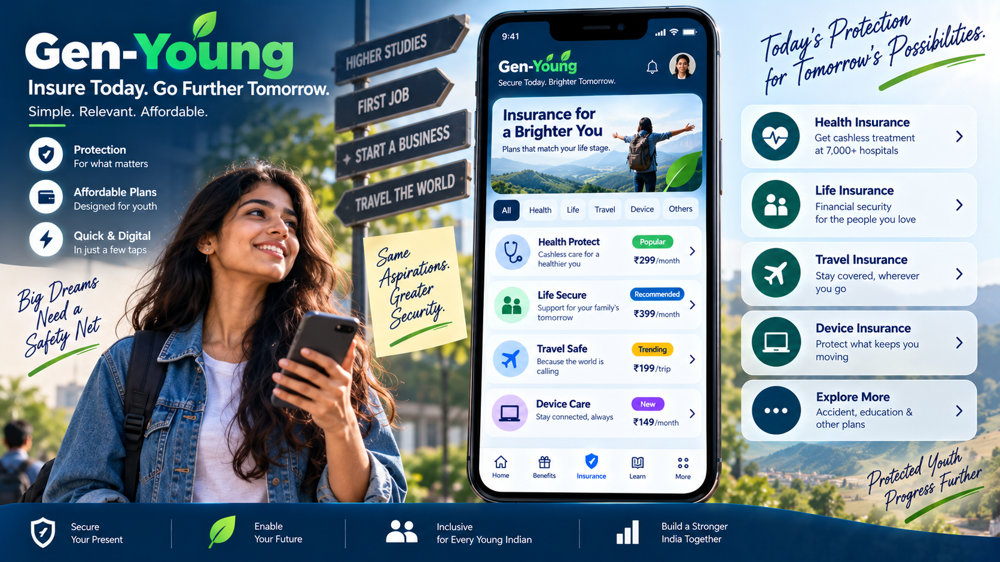
</p>

**Insure Today. Go Further Tomorrow.** Youth-priced protection that grows with your life — *Simple. Relevant. Affordable.*

| Plan | Cover | Youth Price |
|---|---|---|
| 🩺 **Health Protect** *(Popular)* | Cashless care at 7,000+ hospitals | **₹299/month** |
| 👨‍👩‍👧 **Life Secure** *(Recommended)* | Financial security for people you love | **₹399/month** |
| ✈️ **Travel Safe** *(Trending)* | Stay covered wherever you go | **₹199/trip** |
| 💻 **Device Care** *(New)* | Protect what keeps you moving | **₹149/month** |

**Government-backed layer** *(activation-led, not sales-led)*:

- **PMJJBY** — ₹2 lakh life cover, eligible account holders aged 18–50
- **PMSBY** — accidental death & disability cover, eligible account holders aged 18–70
- **Ayushman Bharat PM-JAY** — up to ₹5 lakh per family per year for eligible hospitalization (subject to official eligibility)

The app maintains a **Protection Wallet** showing active schemes, next premium date, nominee information, and claim guidance — all readable and hearable through the accessibility layer.

---

### 👥 10 — Youth Community

<p align="center">
  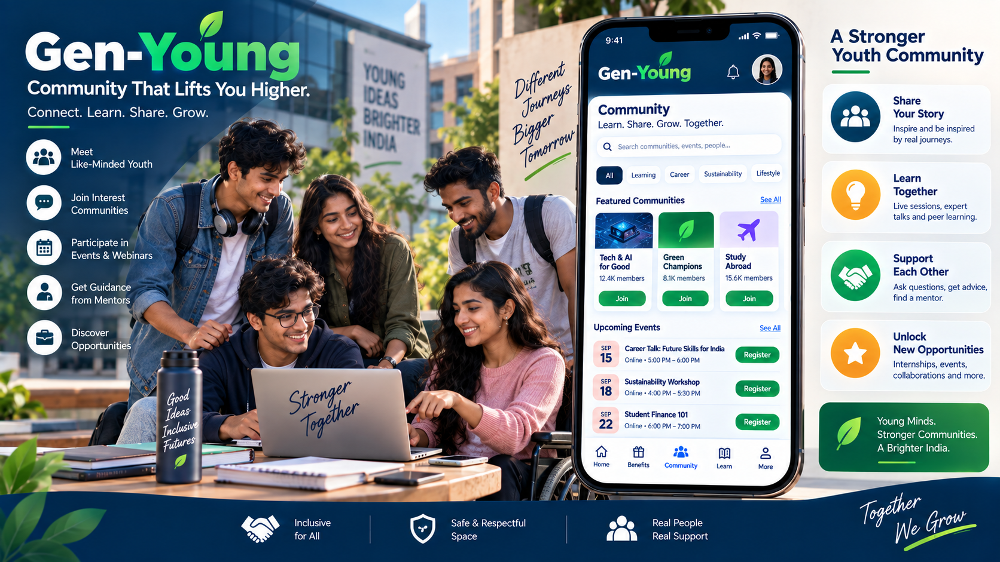
</p>

**Community That Lifts You Higher.** *Connect. Learn. Share. Grow.* A safe, respectful space where like-minded young Indians meet, learn, and unlock opportunities together.

**Featured communities** *(demo counts)*: 🧠 Tech & AI for Good (12.4K) · 🌱 Green Champions (8.1K) · ✈️ Study Abroad (15.6K).

**What you get:**

- 📣 **Share Your Story** — inspire and be inspired by real journeys
- 💡 **Learn Together** — live sessions, expert talks, peer learning
- 🤝 **Support Each Other** — ask questions, get advice, find a mentor
- ⭐ **Unlock New Opportunities** — internships, events, collaborations

**Upcoming Events** demo: *Career Talk: Future Skills for India* · *Sustainability Workshop* · *Student Finance 101* — with **Inclusive · Safe & Respectful · Real People, Real Support** as the community charter.

---

### 🌿 11 — My Green Impact

<p align="center">
  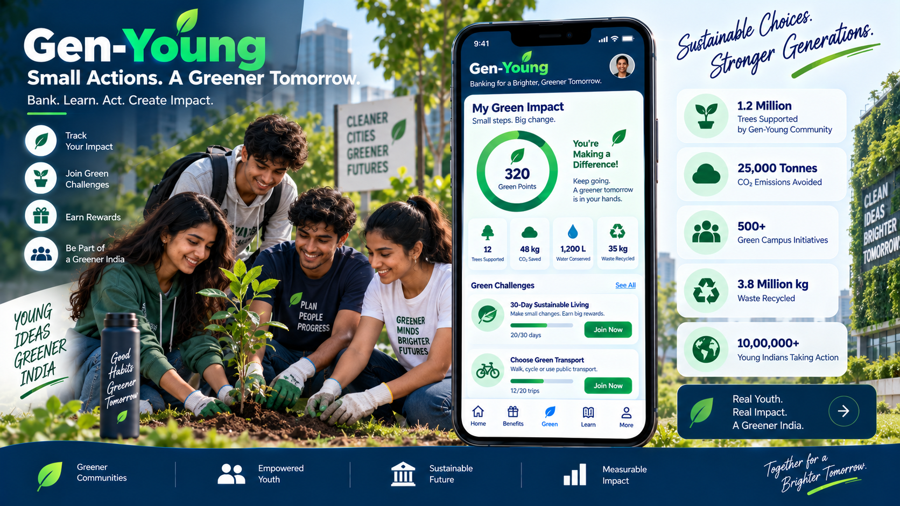
</p>

**Small Actions. A Greener Tomorrow.** *Bank. Learn. Act. Create Impact.* Track your personal green footprint alongside a live community impact dashboard.

**Your dashboard:** 320 Green Points · 12 Trees Supported · 48 kg CO₂ Saved · 1,200 L Water Conserved · 35 kg Waste Recycled.

**Live green challenges:** 30-Day Sustainable Living · Choose Green Transport.

**Community impact** *(rolled up across all Gen-Young users)*:

| Metric | Impact |
|---|---|
| 🌳 **Trees Supported** | 1.2 Million |
| ☁️ **CO₂ Emissions Avoided** | 25,000 Tonnes |
| 🏫 **Green Campus Initiatives** | 500+ |
| ♻️ **Waste Recycled** | 3.8 Million kg |
| 👥 **Young Indians Taking Action** | 10,00,000+ |

---

### 🌱 12 — Your Green Journey

<p align="center">
  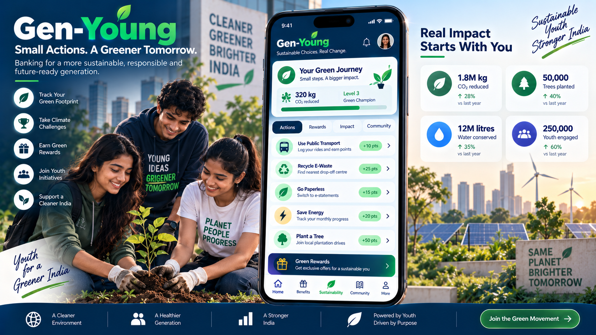
</p>

**Sustainable Choices. Real Change.** A gamified green passport that rewards verified eco-actions — 320 kg CO₂ reduced · **Level 3 Green Champion** status.

**Earn green points for real actions:**

| Action | Points |
|---|---|
| 🚌 Use Public Transport | +10 pts |
| ♻️ Recycle E-Waste (find nearest drop-off) | +25 pts |
| 📄 Go Paperless (switch to e-statements) | +15 pts |
| ⚡ Save Energy (track monthly progress) | +20 pts |
| 🌳 Plant a Tree (join local plantation drives) | +50 pts |

**Real impact starts with you** — year-over-year growth: 1.8M kg CO₂ reduced (↑28%) · 50,000 Trees planted (↑40%) · 12M litres water conserved (↑35%) · 250,000 youth engaged (↑60%).

> *Report measurable actions such as courses completed, digital documents avoided and sustainability activities completed. Avoid unsupported carbon claims.* — Concept paper §25

---

### 🎯 13 — Your Growth Hub (Skills)

<p align="center">
  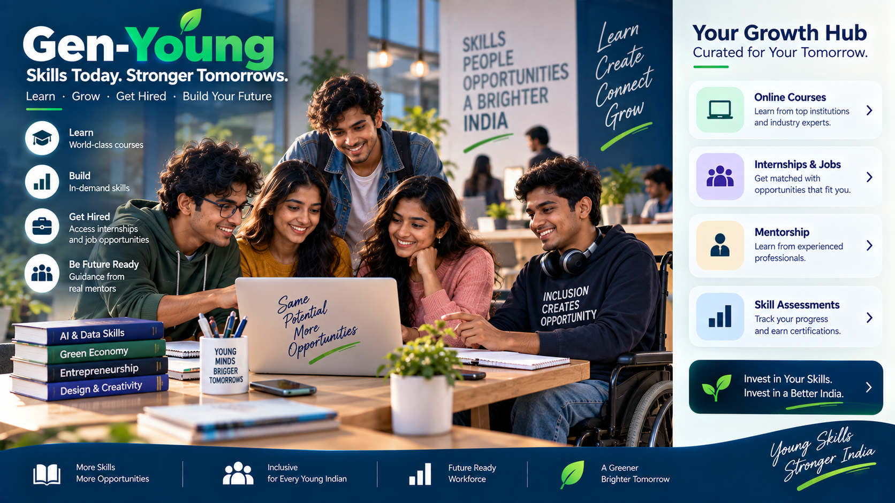
</p>

**Skills Today. Stronger Tomorrows.** *Learn · Grow · Get Hired · Build Your Future.*

**Four tiles to move your career forward:**

- 💻 **Online Courses** — learn from top institutions and industry experts
- 👥 **Internships & Jobs** — get matched with opportunities that fit you
- 👨‍🏫 **Mentorship** — learn from experienced professionals
- 📈 **Skill Assessments** — track your progress and earn certifications

**Curated skill tracks** for the Indian youth market: **AI & Data Skills · Green Economy · Entrepreneurship · Design & Creativity** — plus content pipelines from **SWAYAM · NPTEL · SATHEE · AIKosh · Skill India** and approved AI-learning partners.

> *Same Potential. More Opportunities. Inclusion Creates Opportunity.*

---

### ♿ 14 — Inclusive by Design

<p align="center">
  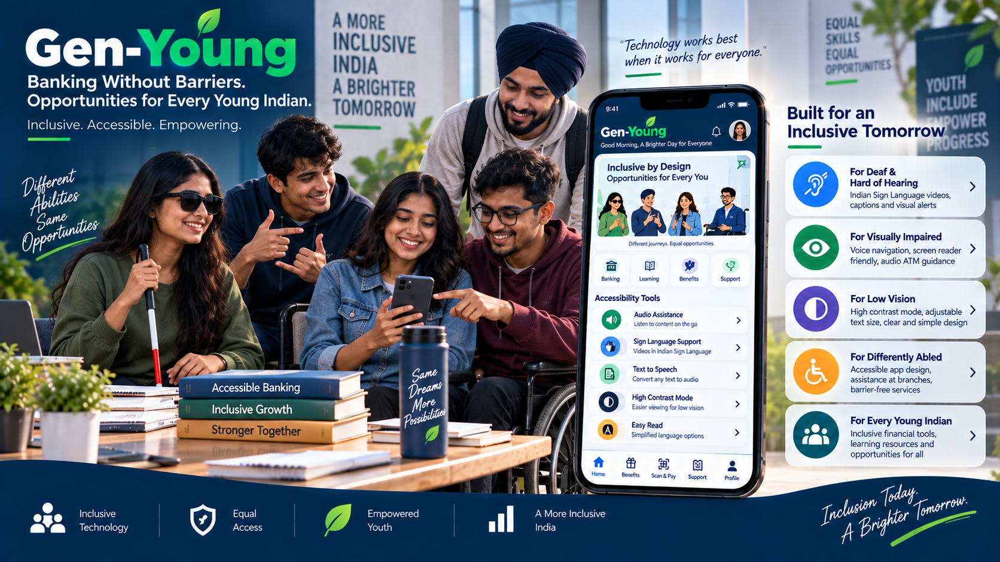
</p>

**Banking Without Barriers.** *Opportunities for every young Indian. Inclusive. Accessible. Empowering.*

**"Technology works best when it works for everyone."** Accessibility is not a features page — it shapes the app from onboarding through every benefit claim.

**Accessibility Tools built into the shell:**

- 🔊 **Audio Assistance** — listen to content on the go
- 🤟 **Sign Language Support** — videos in Indian Sign Language
- 📝 **Text to Speech** — convert any text to audio
- 🌓 **High Contrast Mode** — easier viewing for low vision
- 🅰️ **Easy Read** — simplified language options

**Built for an Inclusive Tomorrow:** For Deaf & Hard of Hearing · For Visually Impaired · For Low Vision · For Differently Abled · For Every Young Indian.

> *Same Dreams. More Possibilities.*

---

### 🌐 15 — Accessibility Deep Dive

<p align="center">
  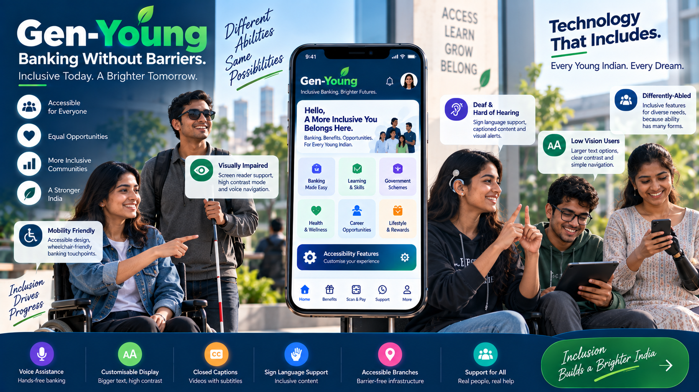
</p>

**Different Abilities. Same Possibilities.** *Inclusion Drives Progress.*

**Six universal-access features across the platform:**

| Feature | Who It Serves |
|---|---|
| 🎤 **Voice Assistance** | Hands-free banking for everyone |
| 🅰️ **Customisable Display** | Bigger text, high contrast |
| 💬 **Closed Captions** | Videos with subtitles |
| 🤟 **Sign Language Support** | Inclusive content in ISL |
| 🏦 **Accessible Branches** | Barrier-free infrastructure |
| 🆘 **Support for All** | Real people, real help |

**Purpose-built for every ability group:**

- 👂 **Deaf & Hard of Hearing** — sign language support, captioned content, visual alerts
- 👁️ **Visually Impaired** — screen reader support, high contrast mode, voice navigation
- 🔎 **Low Vision Users** — larger text options, clear contrast, simple navigation
- ♿ **Mobility Friendly / Differently-Abled** — accessible design, wheelchair-friendly banking touchpoints, inclusive features for diverse needs

> *For Indian users, sign language is designed around **Indian Sign Language (ISL)** — ASL and ISL are not the same language.* — Concept paper §23

---

### 🎓 16 — Career Ready: From Learning to Earning

<p align="center">
  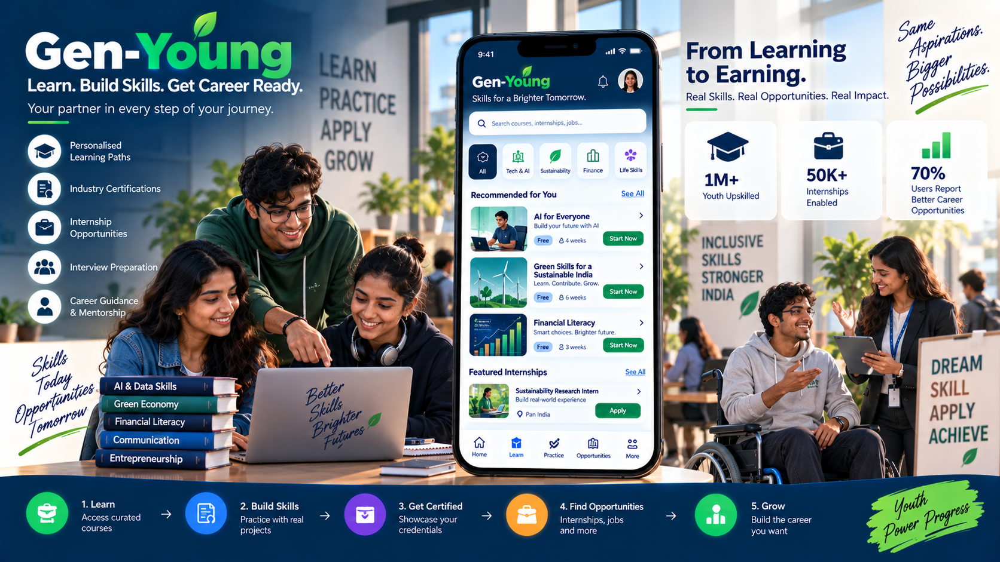
</p>

**Learn. Build Skills. Get Career Ready.** *Your partner in every step of your journey.*

**Five career supports:** Personalised Learning Paths · Industry Certifications · Internship Opportunities · Interview Preparation · Career Guidance & Mentorship.

**Recommended tracks:** AI for Everyone (4 weeks) · Green Skills for a Sustainable India (6 weeks) · Financial Literacy (3 weeks) · Sustainability Research Internships (Pan India).

**The 5-step career journey:**

> **1. Learn** *(access curated courses)* → **2. Build Skills** *(practise with real projects)* → **3. Get Certified** *(showcase your credentials)* → **4. Find Opportunities** *(internships, jobs and more)* → **5. Grow** *(build the career you want)*

**Impact indicators:** 1M+ Youth Upskilled · 50K+ Internships Enabled · 70% Users Report Better Career Opportunities.

---

### ⛅ 17 — Weather Alerts & Women's Safety

<p align="center">
  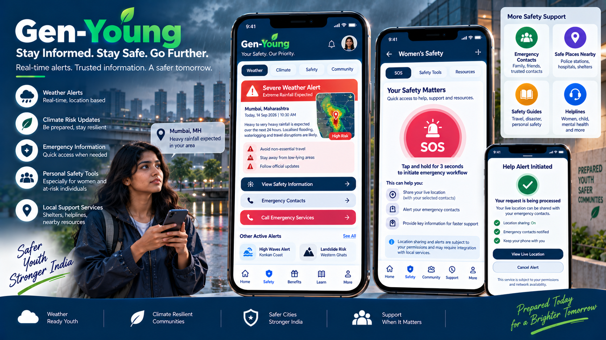
</p>

**Stay Informed. Stay Safe. Go Further.** Real-time alerts, trusted information, a safer tomorrow — even when there is no banking transaction to be done.

**Weather & climate safety:**

- 🌧️ **Weather Alerts** — real-time, location-based (e.g. *Severe Weather Alert — Heavy rainfall expected in Mumbai, Maharashtra*)
- 🌱 **Climate Risk Updates** — be prepared, stay resilient
- 🚨 **Emergency Information** — quick access when needed
- 🛡️ **Personal Safety Tools** — especially for women and at-risk individuals
- 📍 **Local Support Services** — shelters, helplines, nearby resources

**Women's Safety hub:** SOS · Safety Tools · Resources — *Help Alert Initiated* status screen with **Location sharing: On · Emergency contacts notified · Keep your phone with you** and one-tap *View Live Location* or *Cancel Alert*.

**More safety support:** Emergency Contacts · Safe Places Nearby (police stations, hospitals, shelters) · Safety Guides (travel, disaster, personal safety) · Helplines (women, child, mental health).

> *Source discipline: a warning identifies the issuing authority, time, area and severity. The app never generates its own emergency warning from an uncertain AI model.* — Concept paper §19

---

### 🤝 18 — Brand Partnerships: A Sustainable Commercial Model

<p align="center">
  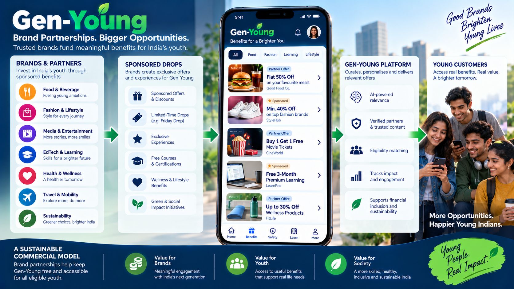
</p>

**Brand Partnerships. Bigger Opportunities.** Trusted brands fund meaningful benefits — while keeping Gen-Young **free and accessible for all eligible youth**.

**How partners engage:**

| Brand Category | Sponsored Drop Types |
|---|---|
| 🍽️ Food & Beverage | Sponsored Offers & Discounts |
| 🛍️ Fashion & Lifestyle | Limited-Time Drops (Friday Drop) |
| 🎬 Media & Entertainment | Exclusive Experiences |
| 📚 EdTech & Learning | Free Courses & Certifications |
| ❤️ Health & Wellness | Wellness Lifestyle Benefits |
| ✈️ Travel & Mobility | Local & Seasonal offers |
| 🌱 Sustainability | Green & Social Impact Initiatives |

**Platform value chain** — AI-powered relevance · Verified partners & trusted content · Eligibility matching · Impact & engagement tracking · Supports financial inclusion and sustainability.

**Three-way value:**

> 💰 **Value for Brands** — meaningful engagement with India's next generation<br>
> 👥 **Value for Youth** — access to useful benefits that support real life needs<br>
> 🌱 **Value for Society** — a more skilled, healthy, inclusive and sustainable India

*No full-screen flash ads. No unrelated banners. No repeated pop-ups. Sponsored content is clearly labelled and sits inside the Benefits Marketplace.*

---

### 🎙️ 19 — Voice-First Banking · Gov Benefits · Local Offers

<p align="center">
  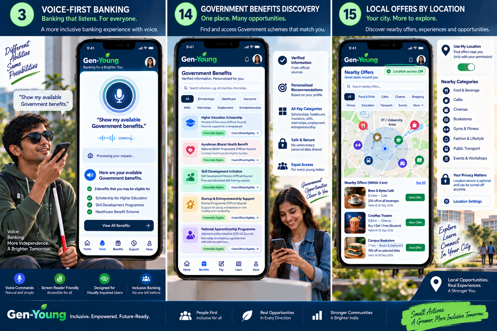
</p>

Three feature deep-dives on one board — showing how a single profile powers universal, discoverable, hyper-local experiences.

#### 🎤 Feature 3 — Voice-First Banking

*Banking that listens. For everyone.* Speak your intent: **"Show my available Government benefits"** — the assistant listens, processes, and returns eligible schemes: *3 benefits found — Scholarship for Higher Education · Skill Development Programme · Healthcare Benefit Scheme.*

**Bottom-of-screen accessibility ribbon:** Voice Commands (natural and simple) · Screen Reader Friendly (accessible for all) · Designed for Visually Impaired Users · Inclusive Banking (no one left behind).

#### 🏛️ Feature 14 — Government Benefits Discovery

*One place. Many opportunities.* A **myScheme-modelled** discovery layer with search across Scholarships · Healthcare · Insurance · Skills · Internships · Employment · Entrepreneurship.

**Sample verified opportunities:** Higher Education Scholarship (Ministry of Education) · Ayushman Bharat Health Benefit (National Health Programme) · Skill Development Initiative (Skill Development Mission) · Startup & Entrepreneurship Support · National Apprenticeship Programme.

**Trust promise:** Verified Information · Personalised Recommendations · All Key Categories · Safe & Secure (no unnecessary personal data shared) · Equal Access for every young Indian.

#### 📍 Feature 15 — Local Offers by Location

*Your city. More to explore.* Permission-based nearby offers — coarse location or manually selected locality (no continuous GPS trail). Categories: Food & Beverage · Cafés · Cinemas · Bookstores · Gyms & Fitness · Fashion · Public Transport · Events & Workshops.

**Location is optional, always** — *Your Privacy Matters: Location access is optional and can be turned off anytime.*

---

### 🌈 20 — More Than Banking: A Brighter Tomorrow

<p align="center">
  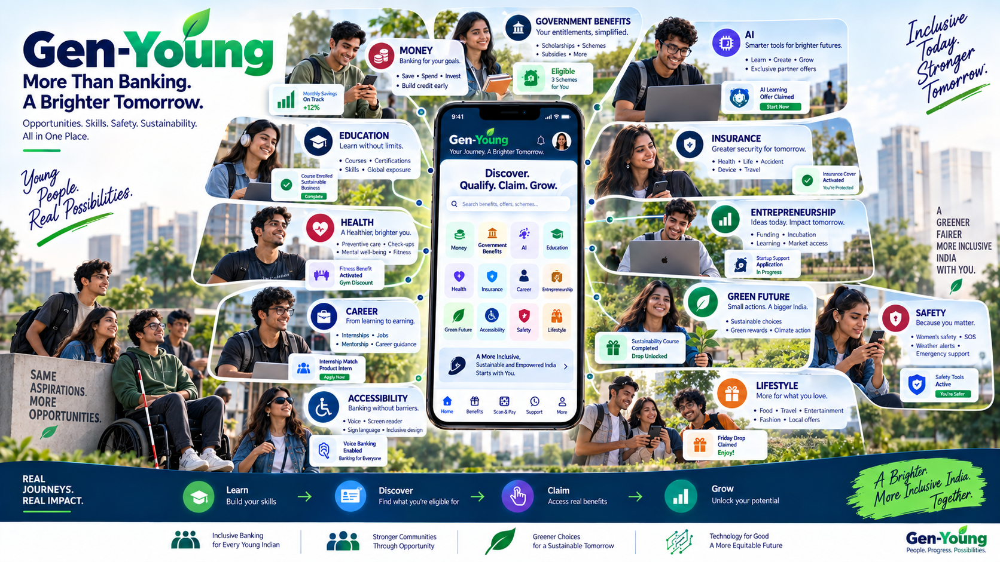
</p>

**More Than Banking. A Brighter Tomorrow.** *Opportunities. Skills. Safety. Sustainability. All in One Place.*

The full Gen-Young universe on a single canvas — with the home dashboard's twelve entry tiles at the centre and live status callouts around every module: **Money** (Monthly Savings On Track +12%) · **Government Benefits** (3 Schemes Eligible for You) · **Education** (Course Enrolled — Sustainable Business Complete) · **AI** (AI Learning Offer Claimed — Start Now) · **Health** (Fitness Benefit Activated — Gym Discount) · **Insurance** (Insurance Cover Activated — You're Protected) · **Career** (Internship Match — Product Intern — Apply Now) · **Entrepreneurship** (Startup Support Application In Progress) · **Green Future** (Sustainability Course Completed — Drop Unlocked) · **Safety** (Safety Tools Active — You're Safer) · **Lifestyle** (Friday Drop Claimed — Enjoy!) · **Accessibility** (Voice Banking Enabled — Banking for Everyone).

> **The 4-verb loop across the entire product:** **Learn · Discover · Claim · Grow.**

**Six product commitments:** Inclusive Banking for Every Young Indian · Stronger Communities Through Opportunity · Greener Choices for a Sustainable Tomorrow · Technology for Good · A More Equitable Future · **A Brighter, More Inclusive India. Together.**

---

## 👥 The Lifecycle Model

Gen-Young does not treat every person under 25 as one customer type. **Age sets the base journey; student status, employment, interests, and location refine the experience** — always changeable in Settings, always consent-driven.

| Age / Life Stage | Primary Focus |
|:---:|---|
| **Under 15** | Guardian-led journey — age-appropriate learning and family-approved benefits |
| **15–17** | Learn, explore, stay safe, discover opportunities · AI literacy · competitive exams |
| **18–20** | Study, earn, protect · independent banking · internships · professional tools · lifestyle |
| **21–23** | Career · money management · internships · professional tools |
| **24–25** | Career growth · entrepreneurship · protection · investments |
| **26–29 (transition)** | Migration into a young-professional proposition with continued benefit discovery |

> The relationship does not end sharply at 25 — customers migrate into a young-professional proposition where appropriate. A first-year student might open the app mainly for learning and Drops; two years later the same customer may use it for an internship, credit, investment, insurance, and professional software.

---

## ♿ Inclusivity & Accessibility-First

Every image in the showcase above intentionally features users with visible mobility aids, guide canes, and diverse abilities — because **inclusivity is not a feature we ship in v2. It's the constraint every screen is designed against from v1.**

### The Six Inclusivity Commitments

| Commitment | How It Ships |
|---|---|
| 🗣️ **Read-Aloud for Everyone** | Native **Web Speech API** TTS on every information page with play / pause / speed controls |
| 🤟 **Indian Sign Language (ISL) Guides** | Visual ISL walkthroughs for every core banking action (send money, freeze card, claim benefit, trigger SOS) — designed around ISL, **not ASL** |
| 🎨 **WCAG AAA High-Contrast Mode** | A dedicated theme that exceeds AAA contrast ratios — not cosmetic dark mode |
| 🔠 **Dynamic Text Scaling** | System-honouring font scaling from small to XXL with reflowing layouts |
| 🌐 **Easy Mode / Easy Read** | Simplified language and iconography for first-time smartphone users and cognitive accessibility needs |
| 👨‍👩‍👧 **Minors with Guardian** | Explicit user class with dual-consent flows — because 15-year-olds deserve access, and guardians deserve visibility |

### Five User Classes Explicitly Modelled

**Students · Job Seekers · Young Professionals · Differently-Abled Users · Minors (with Guardian)** — every feature validated across all five personas before it ships.

### Inclusive UX Principles

- **Colour is never the only signal** — an expiring offer says *"Expires tomorrow"* **and** shows an icon, not just red text.
- **Accessibility is universal** — settings are available without proving a disability (a customer may temporarily need larger text or captions).
- **Partner offers must meet the same standard** — a beautiful third-party coupon that can't be used with a screen reader weakens the whole proposition.

> **You're Not Alone. For Everyone, Always. Inclusive for All.**

---

## 🤟 Text-to-Sign-Language Integration & Citation

Gen-Young proudly incorporates assistive-technology research and sign-language glossing architecture developed in:

> **Core Engine:** [37OMKAR / text-to-signlanguage](https://github.com/37OMKAR/text-to-signlanguage.git)
> *"Type a sentence. A 3D avatar signs it. Web-based, accessibility-first, no video playback anywhere in the pipeline."*

As articulated in **Chapter 23 of the Gen-Young Concept Paper** (*"Sign language, Braille and inclusive communication"*):

> *"Your existing text-to-sign-language work can become a major Gen-Young differentiator. Important Government-benefit information, banking instructions and educational material can be made available through a sign-language interface. For an Indian customer base, the product should be designed around Indian Sign Language (ISL) as the local requirement..."*

### Key Capabilities Powered by this Integration

1. **Rule-Based NLP Glossing** — Deterministic lemmatization, stopword filtering, and SOV grammar reordering that converts conversational banking prompts into Indian Sign Language (ISL) gloss tokens.
2. **Interactive Gesture Demonstrator** — Animated procedural handshape and posture visualization for high-stakes banking flows (card freeze, UPI transfer, balance query) and Emergency SOS dispatches.
3. **Universal Multi-Modal Access** — Seamless parity across visual text, Web Speech TTS narration, and ISL visual gestures — without heavy external video dependencies.

---

## 🏛️ The 7 Core Pillars

| # | Pillar | Description & Key Features |
|:---:|---|---|
| **R1** | **Banking Foundation** | Zero-minimum-balance youth savings account, virtual RuPay debit card with a **3D card flip**, one-tap freeze/unfreeze, simulated UPI transfers with success chimes, target-based savings pots with **confetti milestones** |
| **R2** | **Benefits Engine** | Personalised matching for ages 15–25 across 10 opportunity categories, **5-question benefit cards** (What · Why · Who · Cost · Next), **"Why am I seeing this?"** DPDP attribution, and the **4-state Benefits Wallet** (Available → Claimed → Active → Expiring Soon) |
| **R3** | **Friday Drop Engine** | Flagship weekly drops · **millisecond-accurate countdown** · live inventory bar · server-verified claim decrements · double-claim prevention · fair-access waitlists · five Drop types (Scheduled · Learning · Local · Event · Milestone) |
| **R4** | **Emergency SOS Hub** | **3-second hold trigger** with SVG progress animation and Web Audio beeps · 10-second false-alarm abort window · **112 ERSS** integration · up to 5 trusted-contact alerts · live GPS · weather / hazard warnings |
| **R5** | **Financial Literacy & Quests** | Micro-learning modules (Budgeting · Saving · Smart Banking · Investing · Credit) · 5-minute interactive quizzes · daily streaks (🔥 N-Days) · XP-based level progression (Novice → Master) · multi-step action quests |
| **R6** | **Green Gen-Young** | **Green Learning Hub** connecting users to UN SDG Academy and UN CC:e-Learn · **Green Passport** tracking verified eco-actions · paperless-first metrics dashboard · verifiable green badges · measurable actions only (no unsupported carbon claims) |
| **R7** | **Universal Accessibility** | Web Speech API Read-Aloud (TTS) · WCAG AAA high-contrast · dynamic text scaling · **Indian Sign Language** visual guides · Easy Read · voice-first commands · DPDP privacy controls |

---

## 💻 Tech Stack

| Layer | Technology |
|---|---|
| **Frontend Core** | React 18 · TypeScript 5 · Vite 5 |
| **Styling** | Tailwind CSS 3 with High-Contrast and dark accessibility palettes |
| **Icons** | Lucide React |
| **Audio** | Native **Web Audio API** — `AudioContext` oscillators for procedural countdown beeps, SOS sirens, UPI chimes (**zero external audio dependencies**) |
| **Speech** | Native **Web Speech API** — `window.speechSynthesis` for read-aloud with play / pause / speed |
| **State** | Context Providers — PersonaContext · BankingContext · BenefitsContext · AccessibilityContext · ToastContext (with `localStorage` persistence) |
| **Testing** | Custom E2E harness across 4 tiers (feature · boundary · combinatorial · scenario) — **450/450 tests passing** |
| **Specification** | [GEN-YOUNG 50-Page Concept Paper](GEN-YOUNG_50_Page_Concept_Paper.pdf) |

---

## 🚀 Getting Started

### Prerequisites

- **Node.js** v18 or higher
- **npm** or **yarn**

### Installation & Run

```bash
# Navigate to the app directory
cd gen_young_app

# Install dependencies
npm install

# Start the local development server
npm run dev

# Build for production
npm run build

# Run the full E2E test suite (450 tests)
npm test
```

### Project Structure

```
gen_young_app/
├── src/
│   ├── components/          # UI components (banking, common)
│   ├── context/             # PersonaContext, BankingContext, AccessibilityContext, ToastContext
│   ├── data/                # Mock personas for the five user classes
│   ├── types/               # TypeScript types (persona, banking, benefits, drops, sos, green, learning, accessibility)
│   ├── utils/               # Formatters, sound effects, confetti, className helpers
│   ├── views/               # Top-level views (Home, Benefits, Drops, SOS, Learn, Profile)
│   ├── App.tsx
│   └── main.tsx
├── tests/                   # 4-tier E2E harness — 450/450 passing
└── package.json

docs/
└── assets/                  # 20 concept design boards (01-hero through 20-all-in-one)
```

---

## 🗺️ Roadmap

- [x] **Phase 0** — Architectural Survey & Formal Specification Mining (50 chapters · R1–R7 · 40 features)
- [x] **Milestone 1** — Core Scaffolding, App Shell, Persona Context, Virtual Debit Card, UPI Simulator, and E2E Test Harness — ✅ **100% E2E pass (450/450 tests)**
- [ ] **Milestone 2** — Benefits Engine, Categorised Marketplace, 5-Question Cards, "Why am I seeing this?" attribution, and 4-State Wallet
- [ ] **Milestone 3** — Friday Drop Engagement Engine & Emergency SOS 112 Hub with trusted-contact fan-out
- [ ] **Milestone 4** — Financial Learning Quests, Green Passport, Universal Accessibility (TTS / ISL / High-Contrast / Easy Mode), and DPDP Privacy Centre
- [ ] **Milestone 5** — Community Hub, Insurance activation flows, Brand-Partnership marketplace surface, and Weather/Hazard alerts
- [ ] **Milestone 6** — Full Integration Verification & End-to-End Test Suite Pass across all seven pillars

---

## 🔐 Trust, Privacy & Compliance

Gen-Young is built to be **credible under scrutiny** — every benefit needs a source, eligibility rule, owner, validity date, claim route, and customer disclosure.

| Principle | How It Shows Up |
|---|---|
| 🔒 **DPDP Act Compliance** | Bank-controlled matching; brands never receive customer phone numbers or contact details unless the customer has explicitly claimed the offer |
| 🚫 **No Cold Calling** | Benefits are never an excuse for unsolicited sales calls — a clear, promised part of the product |
| 🎛️ **Privacy & Offers Control Centre** | Customers see and control location-based offers, partner personalisation, marketing, and third-party sharing separately from essential service messages |
| 🔍 **"Why am I seeing this?"** | Every recommendation is inspectable — e.g. *"Shown because you selected food offers and are currently near this area"* |
| 📅 **Verification Dates** | Every Government scheme carries an owner, source URL, last-checked date, effective period, and change history |
| 🏛️ **Source Discipline** | Weather / hazard alerts always identify the issuing authority — never AI-generated |
| ♿ **Accessibility as a Universal Preference** | Accessibility settings never require proving a disability |

---

## 📜 License & Acknowledgements

Built for the **Gen-Young digital youth banking initiative**. Detailed specifications adapted from the *GEN-YOUNG Digital Youth Banking & Benefits Platform Concept Paper* (50 pages, included in this repository).

Concept visuals depict a deliberately inclusive cross-section of Indian youth — women, men, students on wheelchairs, users with visual impairment aids, users wearing turbans, Sikh, Hindu, Muslim, Christian, and youth from every region — because **the future of Indian youth banking must look like the future of India**.

<p align="center">
  <br>
  <strong>Youth Today. A Stronger Tomorrow.</strong><br>
  <em>Inclusive. Digital. Sustainable. Together.</em><br>
  <br>
  <strong>🌱 It's Your Time. 🌱</strong>
</p>
